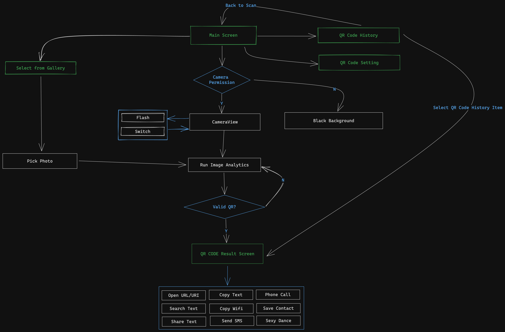

# Android QR Code Scanner by Dan Tech

This project is built with Jetpack Compose, CameraX, ML Kit and my handsome attitude.
This is for my learning purpose in order to get familiar with Jetpack Compose, MLKit and CameraX.
Feel free to use it in your project.




## Features

- [x] Scanning multiple types of QR Code, Bar Code, ... with the power of Google MLKit
- [x] Pick image from gallery and scan QR Code from it
- [x] Historize your QR Codes
- [ ] Generate QR Code from your content
- [ ] Beautify your QR Code

## Tech Stack (Using and Planning to Use)

- [x] Jetpack Compose
- [x] Compose Navigator
- [x] CameraX
- [x] ML Kit
- [x] SharedFlow
- [x] StateFlow
- [x] Hilt
- [x] Coroutines, Flow
- [ ] ZXing
- [ ] Coil
- [ ] Unit Test
- [ ] UI Test
- [ ] Idk, I will add more later

## Improvement
- [x] Reduce numbers of Flow in MainViewModel
- [ ] Update better UI
- [ ] Animation


### Download, Clone, or do anything for your own purpose, I don't care!

### Love it? Give me a star, I will be happy!

### Happy Coding!

```
Life runs on code!
```
